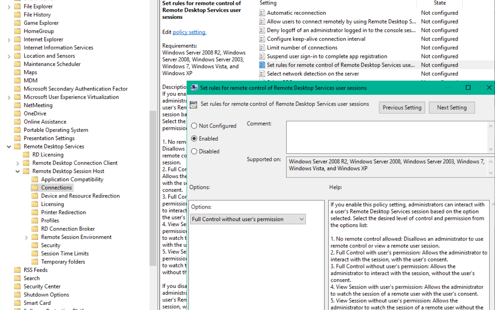
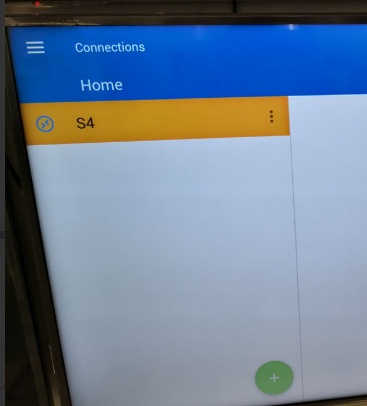
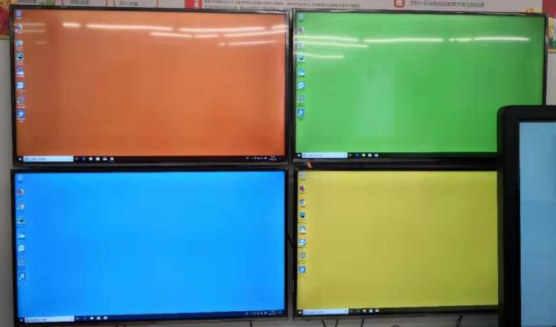
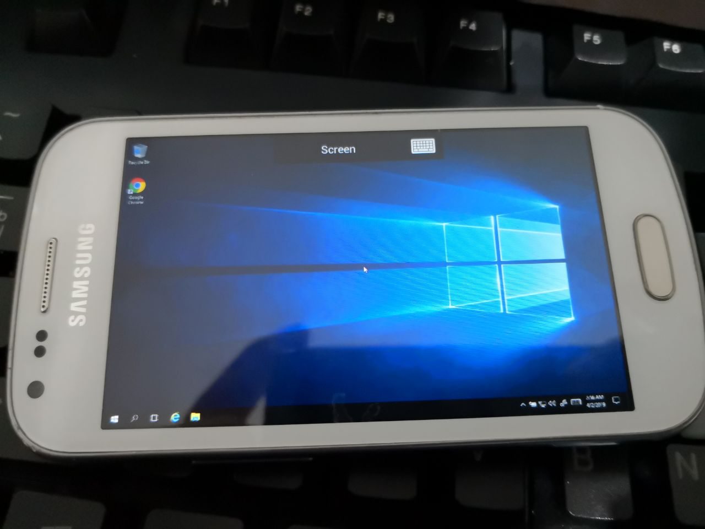

# rdp_shadow

  

Use MSRDP client on TV as presentation screen, and control content remotely on another computer

## Usage

### 1. Config PC Side as Server

- You need a Windows Server OS, or install [RDP Wrap](https://github.com/stascorp/rdpwrap) to patch your system to allow multi users logging in at the same time.
- Create a management account (as Administrator), and accounts for each screens (as User).
- Turn on your RDP, and allow these accounts to be logged in remotely.
- Change the `Group Policy` to allow silent shadow connection.
  - At `Computer Configuration\Administrative Templates\Windows Components\Remote Desktop Services\Remote Desktop Session Host\Connections\`
  - Change `Set rules for remote control of Remote Desktop Services user sessions` to `Full control without user's permission`  
    

### 2. Screen Side as Client

- Install RDP software on your TV. For Android system, I recommend [Remote Desktop Manager](https://remotedesktopmanager.com/) for best full-screen view. For low memory clients, you can also use [Microsoft RDP](https://play.google.com/store/apps/details?id=com.microsoft.rdc.android).
- Config your server address, port, resolution, etc.
  
- Connect to your screen's user account of the server.
- Wait for desktop to load.  
    
  

### 3. Manage Screens on PC

- Log into the management account using RDP, or physically on the PC it self.
- Copy these scripts, edit  `control.bat`, change the username `Screen1` in the last line to your screen's username.
- If you have several screens, copy `control.bat`, and change the usernames into yours.
- Run `control.bat`, you will be asked for UAC elevation, click Allow.
- You now have a window to control the screen account's desktop.

## Notice

If your content has lots of animation or other moving contents, be aware of the net traffic between the server and the screen could be huge.  
Under 1920*1080 resolution, a continuously animating content could take up to 2MB/s' bandwidth. Better connect the network via wired network, Wi-Fi connection is not reliable.

## Thanks

Thanks to [Matt](https://stackoverflow.com/users/1016343/matt) on StackOverflow for the [elevation batch script](https://stackoverflow.com/a/12264592/1016343).